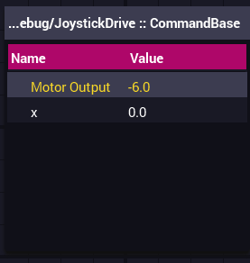

# core (DISCONTINUED)

This library contains tools for the limelight, simulation, and math.

## Installation Url

```txt
https://raw.githubusercontent.com/ThePinkAlliance/core/main/ThePinkAlliance.json
```

## Linear Interpolation

The linear interpolation class takes a list of integer pairs and will interpolate between the input (the first number in the pair) to the calculated output (the mathematically calculated second number in the pairs). Some use cases for linear interpolation may involve using a table of distances give by a limelight to the real distance.

### Example

```java
  /**
  * The pairs are modeled as such (expected_input, expected_output)
  * 
  * In the case of the limelight example (limelight_distane, real_distance)
  */
  List<Pair<Integer, Integer>> points = List.of(
      new Pair<Integer, Integer>(120, 125),
      new Pair<Integer, Integer>(110, 115),
      new Pair<Integer, Integer>(100, 105),
      new Pair<Integer, Integer>(130, 135),
      new Pair<Integer, Integer>(140, 145),
      new Pair<Integer, Integer>(150, 155));
  LinearInterpolationTable table = new LinearInterpolationTable(points);

  double real_distance = table.interp(123); // Outputs 128 inches
```

## Telemetry

The purpose of the Telemetery class is to serve as a replacement for SmartDashboard. Over time, the use of smart dashboard can lead to a cluttered dashboard and can make tuning difficult during competitions. The Telemetry class allows tuning data to be stored in its own tab and organized by parent class.

### Example

```java
  Telemetry.logData("Motor Output", motor.getPower(), JoystickDrive.class);
  Telemetry.logData("x", x, JoystickDrive.class);
```

The code above generates this list which stores all the values being logged for this specific class. Just to clear up some things, how the logger creates list names it starts with the name of the parent class first. After the two colons, `::` it appends what class its extending to the end of the name. The purpose of this makes distinguishing `subsystems` from `commands` easier.

_NOTE: Sometimes the list isn't added to Shuffleboard and may need to be added manually._



## Spherical Coordinates

The spherical coordinates class makes using the spherical coordinate system easier with some built-in utilites. As a quick refresher, instead of using x, y, and z for units, spherical coordinates use projection (r), azimuth (θ), and elevation (Φ). If you're not familar with spherical coordinates theres a great article [here](https://mathinsight.org/spherical_coordinates) to help you out.

### Example

```java
  // Creating coordinates with known constants.
  double x = 0;
  double y = 0;
  double z = 0;

  SphericalCoordinates sphericalCoordinates = SphericalCoordinates.fromCartesian(x, y, z);

  // Convert cartesian coordinates to spherical coordinates.
  Translation3d translation3d = new Translation3d(-2, -1, -7);
  SphericalCoordinates sphericalCoordinates = SphericalCoordinates.fromCartesian(translation3d);

  // Convert spherical coordinates to catesian coordinates.
  SphericalCoordinates coordinates = new SphericalCoordinates(7.34, -2.67, 2.83);
  Translation3d coordinates3d = coordinates.toCartesian();

  // Subtract two coordinates from eachother.
  SphericalCoordinates desiredCoordinates = new SphericalCoordinates(1, Units.degreesToRadians(90),
      Units.degreesToRadians(180));
  SphericalCoordinates currentCoordinates = new SphericalCoordinates(0.5, Units.degreesToRadians(90),
      Units.degreesToRadians(90));
  SphericalCoordinates coordinateDifference = desiredCoordinates.subtract(currentCoordinates);

```
